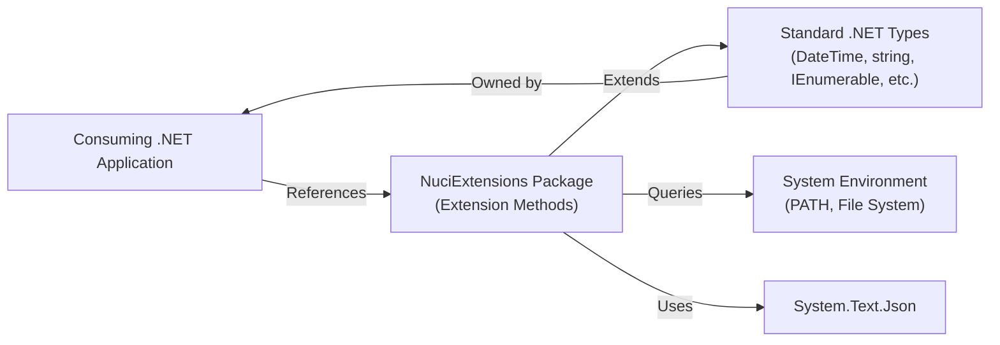
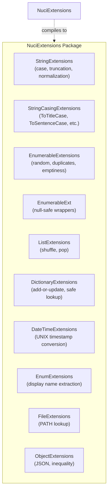
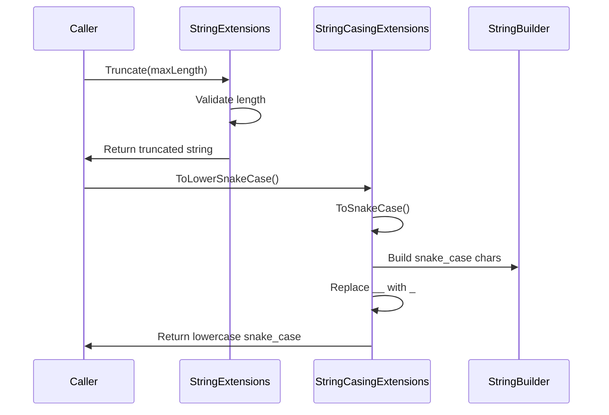
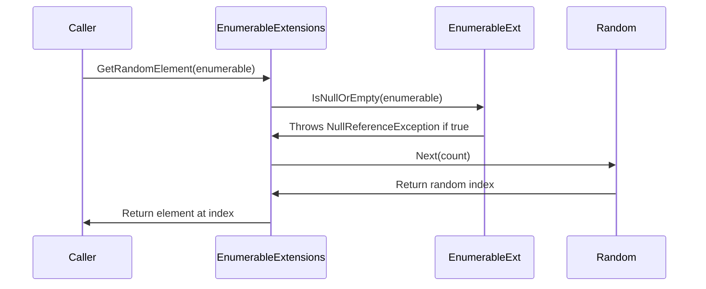
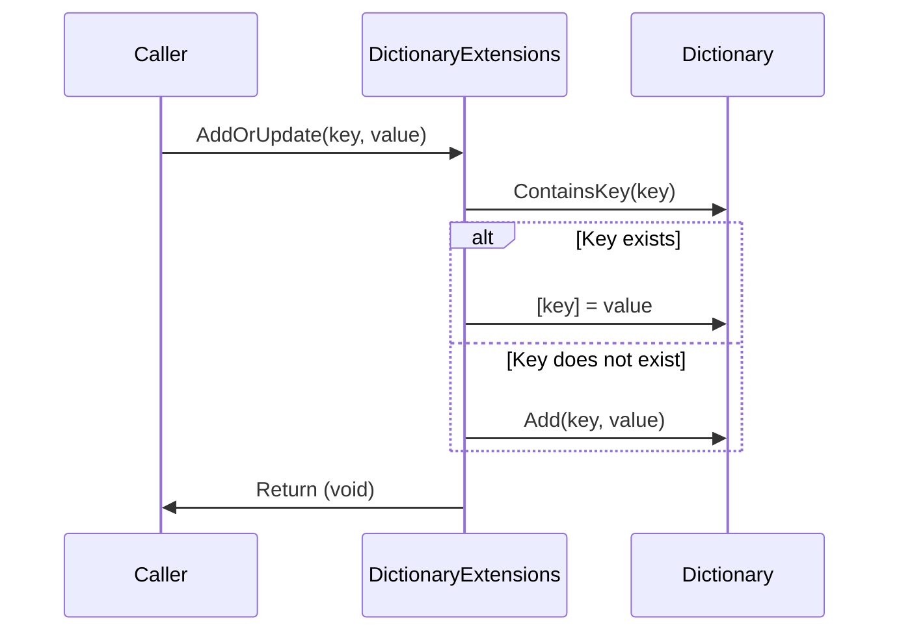
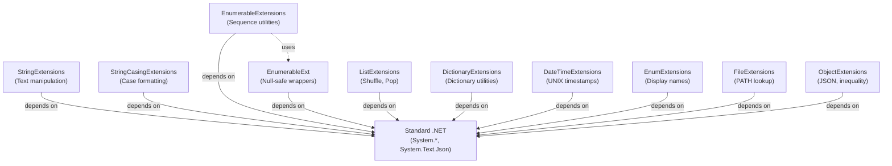

# NuciExtensions Architecture

This document describes the current architecture of NuciExtensions, a .NET NuGet package providing focused extension methods for common tasks across core types. It documents the system boundary, component organization, extension points, and design decisions.

## 📑 Table of Contents

- [Purpose](#-purpose)
- [System Context](#-system-context)
- [Architectural Style](#️-architectural-style)
- [Architectural Areas](#️-architectural-areas)
- [Components](#-components)
- [Interfaces and Integrations](#-interfaces-and-integrations)
- [Compatibility Contracts](#️-compatibility-contracts)
- [External Dependencies](#-external-dependencies)
- [Cross-Cutting Concerns](#️-cross-cutting-concerns)
- [Dependency Direction and Rules](#-dependency-direction-and-rules)
- [Testing and Verification](#️-testing-and-verification)
- [Design Constraints](#️-design-constraints)
- [Extension Points](#-extension-points)
- [Architecture Decisions](#️-architecture-decisions)

## 🎯 Purpose

NuciExtensions is a curated library of extension methods that enhance the usability of standard .NET types without requiring changes to consuming code. The package aims to provide:

- **Small, focused methods** that solve discrete problems
- **Zero runtime overhead** beyond method calls
- **Perfect backward compatibility** across versions
- **Comprehensive test coverage** for reliability

This architecture documentation targets maintainers, contributors, and consumers who need to understand the package's organisation, extension mechanism, and evolution strategy.

## 🌐 System Context

NuciExtensions operates within the .NET ecosystem as a library consumed by other applications and frameworks. The system boundary encompasses the extension methods defined across multiple static classes in the `NuciExtensions` namespace.



The principal external boundaries are:
- **Consuming Applications:** .NET projects that reference the NuciExtensions NuGet package and use the extension methods on standard .NET types
- **Standard .NET Framework Types:** `DateTime`, `string`, `IDictionary<TKey, TValue>`, `IEnumerable<T>`, `IList<T>`, `Enum`, `object`—all extended without modification
- **System Environment:** File system PATH environment variable accessed by the file lookup method
- **System.Text.Json:** Standard serialization framework used by JSON extension methods

## 🏗️ Architectural Style

NuciExtensions follows a **static extension method** architectural pattern, organising functionality into stateless, namespace-scoped groups. This style enables:

- **Non-invasive enhancement** of existing types without inheritance or composition
- **Zero allocation overhead** for method invocations (compiler inlines calls)
- **Transparent integration** into existing call chains
- **Clear responsibility separation** through single-purpose static classes

Each extension class specialises in one domain (DateTime, Dictionary, String, etc.), establishing clear semantic boundaries. The pattern has the following consequences:

1. **Namespace Pollution Mitigation:** All extensions are scoped to the `NuciExtensions` namespace; consumers must opt-in with `using NuciExtensions;`
2. **No Stateful Sharing:** Each method is stateless, eliminating shared-state coupling between consumers
3. **Type Safety:** Compiler-checked method resolution and type parameters prevent runtime discovery errors
4. **Performance Parity:** Extension methods compile to regular static method calls with no boxing or reflection overhead



The principal architecture boundaries are:
- **String Handling:** `StringExtensions` and `StringCasingExtensions` encapsulate text manipulation
- **Collection Operations:** `EnumerableExtensions`, `EnumerableExt`, and `ListExtensions` handle sequence utilities
- **Type Utilities:** `DictionaryExtensions`, `EnumExtensions`, and `ObjectExtensions` extend dictionary, enumeration, and object operations
- **Time and File:** `DateTimeExtensions` and `FileExtensions` handle temporal and filesystem concerns

## 🗂️ Architectural Areas

### String Extensions

**Paths:**
- `NuciExtensions/StringExtensions.cs`
- `NuciExtensions/StringCasingExtensions.cs`

**Responsibilities:**
- Provide case manipulation methods (`InvertCase`, `ToTitleCase`, `ToSentenceCase`)
- Implement normalisation operations (`RemoveDiacritics`, `RemovePunctuation`, `ToSnakeCase`)
- Support string transformations (`Reverse`, `Repeat`, `ReplaceFirst`, `Truncate`, `ToSentence`)
- Enable JSON serialisation and deserialisation (`ToJson`, `FromJson`)

**Boundary rules:**
- String methods must not modify the original string; return new instances
- All operations use `StringBuilder` for concatenation loops to ensure O(n) performance
- Case conversions rely on `System.Globalization.CultureInfo` for correctness
- Diacritic removal defines custom character mappings for enhanced accuracy

### Collection Extensions

**Paths:**
- `NuciExtensions/EnumerableExtensions.cs`
- `NuciExtensions/EnumerableExt.cs`
- `NuciExtensions/ListExtensions.cs`
- `NuciExtensions/DictionaryExtensions.cs`

**Responsibilities:**
- Provide enumerable utilities (`GetRandomElement`, `GetDuplicates`, `IsEmpty`)
- Supply null-safe wrappers for emptiness checks (`IsNullOrEmpty`)
- Implement mutable list operations (`Shuffle`, `Pop`)
- Support dictionary convenience methods (`AddOrUpdate`, `TryGetValue`)

**Boundary rules:**
- Enumerable methods must not consume the sequence more than once; use `Any()` for efficient checks
- Random number generation is statically cached to avoid repeated allocation
- Pop and Shuffle modify the list in place; callers must manage the original reference
- Dictionary add-or-update atomically checks and updates to prevent race conditions in single-threaded contexts

### Type Extensions

**Paths:**
- `NuciExtensions/EnumExtensions.cs`
- `NuciExtensions/ObjectExtensions.cs`
- `NuciExtensions/DateTimeExtensions.cs`
- `NuciExtensions/FileExtensions.cs`

**Responsibilities:**
- Extract display names from enumeration values via reflection (`DisplayAttribute`)
- Provide JSON serialisation wrappers (`ToJson`)
- Support inequality checks for generic types (`NotEquals`)
- Convert between UNIX timestamps and `DateTime` objects
- Verify file existence in system PATH environment variable

**Boundary rules:**
- Enum display extraction uses reflection sparingly; results may be cached by callers
- JSON methods delegate to `System.Text.Json.JsonSerializer` without custom encoding
- UNIX timestamp conversion assumes UTC; callers must manage timezone awareness
- File lookup queries the PATH variable sequentially; results are not cached

## 🧩 Components

| Component | Responsibility | Principal Dependencies | Lifetime or Ownership |
|-----------|----------------|------------------------|-----------------------|
| `StringExtensions` | Text transformation, case management, and JSON round-trip for strings | `System.Globalization`, `System.Text`, `System.Text.Json` | Static; no state |
| `StringCasingExtensions` | Case-sensitive reformatting (title case, sentence case, snake case) | `System.Text` | Static; no state |
| `EnumerableExtensions` | Random selection, duplicate detection, and emptiness checking for sequences | `System.Collections.Generic`, `System.Linq` | Static; shared `Random` instance (cached) |
| `EnumerableExt` | Null-safe wrappers for enumerable emptiness checks | `System.Collections.Generic` | Static; no state |
| `ListExtensions` | In-place shuffling and pop operations for mutable lists | `System.Collections.Generic`, `System.Linq` | Static; shared `Random` instance (cached) |
| `DictionaryExtensions` | Add-or-update and safe value lookup for dictionaries | `System.Collections.Generic` | Static; no state |
| `DateTimeExtensions` | UNIX timestamp conversion in both directions | Built-in; UNIX epoch constant | Static; no state |
| `EnumExtensions` | Display name extraction via `DisplayAttribute` reflection | `System.ComponentModel.DataAnnotations`, `System.Reflection` | Static; no state |
| `FileExtensions` | Filesystem and PATH environment lookup | `System.IO`, `System.Environment` | Static; no state |
| `ObjectExtensions` | Generic inequality and JSON serialisation wrappers | `System.Text.Json` | Static; no state |

## 🔌 Interfaces and Integrations

| Interface or Integration | Direction | Contract | Owner | Failure Semantics |
|--------------------------|-----------|----------|-------|-------------------|
| **NuGet Package Feed** | Outbound | Package `NuciExtensions` compiled to `.nupkg`; consumers fetch via package manager | `NuciExtensions` library | Package unavailability; unmet version constraints fail build |
| **Standard .NET Types** | Outbound | Extension methods via `this` parameter; methods are injected into call chain without modification to types | All extension classes | Type mismatch or method not found at compile time |
| **System.Text.Json** | Outbound | JSON serialisation via `JsonSerializer.Serialize/Deserialize`; no custom options unless caller provides | `ObjectExtensions`, `StringExtensions` | `JsonException` on invalid JSON or mismatched schema; caller must handle |
| **System Environment (PATH)** | Outbound | Environment variable lookup via `Environment.GetEnvironmentVariable("PATH")`; file existence check via `File.Exists` | `FileExtensions` | No error on missing PATH or no matching file; method returns `false` |
| **System.Globalization** | Outbound | Culture-aware character classification via `char.IsUpper`, `char.IsLetter`, etc. | `StringExtensions`, `StringCasingExtensions` | Incorrect results only if custom culture overrides are installed; default behaviour is deterministic |

## 💾 Data Architecture

NuciExtensions does not own persistent data stores. All data transformations are stateless and operate on data provided by the caller.

| Data or Concern | Owner | Representation and Storage | Lifecycle or Consistency |
|-----------------|-------|----------------------------|--------------------------|
| **String State** | Caller | Immutable; new instances created by each transformation method | Created on method entry, eligible for garbage collection on method exit |
| **Collection State** | Caller | Mutable collections are modified in place (Shuffle, Pop); enumerable methods do not modify source | Caller owns lifetime; methods do not cache or retain references |
| **UNIX Timestamp** | Caller | Double or string representation on input; `DateTime` object on output; UTC semantics enforced | Converted at method boundary; no caching |
| **Random State** | Static cache | `System.Random` instance created on first use; shared across all calls in the AppDomain | Singleton; reused for all random selection operations |
| **File System State** | System | Queried via PATH environment variable and file existence checks; no caching | Read-only at invocation time; results may be stale if PATH or filesystem changes |

## 🔀 Key Flows

### String Transformation with Case Normalisation



This flow demonstrates chaining of independent transformations, each returning a new string for immutability.

### Random Element Selection with Null Safety



This flow ensures fail-fast behaviour on invalid input and reuses the cached `Random` instance.

### Dictionary Add-or-Update (Atomic in Single-Threaded Context)



This flow conditionally branches to avoid redundant allocation or overwrites.

## 🧹 Cross-Cutting Concerns

### Error Handling

Extension methods follow fail-fast semantics:

- **Null inputs** throw `NullReferenceException` for backward compatibility (except where documented as returning default)
- **Empty collections** throw `NullReferenceException` on methods expecting elements (e.g., `GetRandomElement`)
- **Out-of-range values** throw `IndexOutOfRangeException` or `ArgumentOutOfRangeException` as documented
- **Malformed JSON** throws `JsonException` from `System.Text.Json`
- **Invalid UNIX timestamps** throw `ArgumentException`

No methods perform retry, degradation, or fallback; all errors propagate to the caller for handling.

### Observability

NuciExtensions emits no logs, metrics, or traces. All diagnostics are derived from:

- **Compiler warnings** for null reference checks on non-nullable parameters
- **Exception messages** which include parameter names and reason
- **Unit test coverage** which verifies error paths

Callers are responsible for logging or monitoring their use of the library.

### Performance Considerations

- **StringBuilder for concatenation:** String methods that loop use `StringBuilder` to avoid O(n²) performance
- **Lazy Random caching:** The static `Random` instance is created only on first use, avoiding allocation on AppDomain startup
- **No reflection caching:** Enum display name extraction via reflection is performed on each call; frequent callers should cache results
- **Zero-allocation primitives:** Methods like `IsEmpty`, `NotEquals`, and `Truncate` allocate no intermediate objects

### Thread Safety

All static fields are **not thread-safe**:

- **Shared `Random` instance** in `EnumerableExtensions` and `ListExtensions` is not synchronised; concurrent calls from multiple threads may produce unexpected results
- **No internal state** exists elsewhere; extension methods are stateless and independent

Callers requiring thread-safe random number generation should pass a thread-local or synchronised `Random` instance to the overloads that accept it.

### Dependency Versioning

NuciExtensions targets `.NET 10.0`, supporting:

- Modern `System.Text.Json` with native Utf8JsonWriter
- Native `ArgumentNullException.ThrowIfNull` helper
- Collection expression syntax for initialisation

Consumers on earlier .NET versions must use earlier releases of this package.

## 🧭 Dependency Direction and Rules

All dependencies flow **inward** toward the core extension methods; no method depends on another extension method.



The principal dependency rules are:

- **No inter-extension dependencies:** No extension class is used by another (exception: `EnumerableExtensions` uses `EnumerableExt.IsNullOrEmpty` for validation)
- **Only standard .NET dependencies:** All external dependencies are provided by the .NET Base Class Library
- **No framework or plugin architecture:** All types are defined as static classes; no runtime reflection or dynamic loading occurs
- **Immutable data crossing boundaries:** Extension methods receive and return immutable or caller-owned data; no shared mutable state is passed

## 📦 External Dependencies

| Dependency | Responsibility | Integration Boundary | Architectural Consequence |
|------------|----------------|----------------------|---------------------------|
| `System.Text.Json` | JSON serialisation and deserialisation | `ObjectExtensions.ToJson*`, `StringExtensions.FromJson*` | Tight coupling to `System.Text.Json` API; no custom JSON implementation |
| `System.Globalization` | Culture-aware character classification | `StringExtensions`, `StringCasingExtensions` | Behaviour depends on installed cultures; default culture is deterministic but may vary across machines |
| `System.Reflection` | Display attribute extraction from enum members | `EnumExtensions.GetDisplayName` | Runtime cost on first call per enum value; frequent callers should cache |
| `System.ComponentModel.DataAnnotations` | Annotation types for enum display values | `EnumExtensions` | Dependency on attributed enums; unmarked enums fall back to `ToString()` |
| `System.IO` | File system and PATH environment access | `FileExtensions.ExistsInPathVariable` | Synchronous I/O; results may be stale if filesystem changes during execution |

## 🛡️ Compatibility Contracts

| Contract | Owner | Invariant | Verification | Change Policy |
|----------|-------|-----------|--------------|---------------|
| **Public Method Signatures** | All extension classes | Method names, parameter types, return types, and exception types must not change | Unit tests verify signatures; CI blocks breaking changes | Semver major version bump required for any signature change |
| **Namespace** | Package root | All extensions must remain in `NuciExtensions` namespace | `using NuciExtensions;` must locate all methods | Cannot relocate or split namespace without major version bump |
| **NuGet Package Identity** | Package feed | Package name, binary versioning, and strong-name (if signed) must remain stable | Package repository and CI verify identity | Cannot change package name or strong-name without major version bump |
| **Exception Types** | All extension classes | Methods throw the documented exception type on error (e.g., `NullReferenceException` for null inputs) | Unit tests verify exception type on each error path | Cannot change exception type without major version bump |
| **Return Value Semantics** | All extension classes | Methods return the specified type with documented meaning; string methods return new instances (never modify input) | Unit tests verify immutability and type correctness | Cannot change return semantics without major version bump |

## ✅ Testing and Verification

The project maintains comprehensive unit test coverage at the method level. Tests verify:

- **Correct output** for representative inputs
- **Exception types and messages** for all documented error cases
- **Boundary conditions** (empty strings, null references, single-element collections)
- **Performance characteristics** (no inadvertent allocations, quadratic loops)
- **Immutability** (string methods do not modify input)

Test files mirror the extension class structure:

- `StringExtensionsTests.cs` ↔ `StringExtensions.cs`
- `StringCasingExtensionsTests.cs` ↔ `StringCasingExtensions.cs`
- `EnumerableExtensionsTests.cs` ↔ `EnumerableExtensions.cs`
- `ListExtensionsTests.cs` ↔ `ListExtensions.cs`
- (and so on for each extension class)

All tests follow the `Given[Precondition]_When[Action]_Then[Assertion]` naming convention and use NUnit 4 assertions.

Execute the principal automated verification with:

```bash
dotnet test NuciExtensions.sln --nologo --collect:"XPlat Code Coverage" --results-directory /tmp/coverage
```

This command runs all 118 unit tests and produces a Cobertura coverage report. **Expected results:**

- **All tests pass** (118/118)
- **100% line coverage** on extension classes (293 lines)
- **100% branch coverage** (108 branches)

## ⚠️ Design Constraints

- **Static extension methods only:** No inheritance, composition, or stateful facades. All functionality is delivered as stateless static methods.
- **Zero allocation overhead:** Methods must not create unnecessary intermediate objects. Callers expect performance parity with manual implementations.
- **Single .NET version target:** The package targets `.NET 10.0` exclusively; backporting to earlier versions requires a separate release branch.
- **No asynchronous methods:** All methods are synchronous; long-running I/O (e.g., file lookup) is not suitable for the extension model.
- **Backward compatibility:** Once a method signature is public, it cannot change without a major version bump. Consumers depend on stable signatures across minor and patch versions.
- **No NuGet package dependencies:** The package has zero runtime dependencies; all functionality derives from .NET Base Class Library types only.
- **Thread-safety of Random:** The shared `Random` instance in enumerable and list extensions is not thread-safe; multi-threaded callers must provide their own synchronised instance.

## 🔧 Extension Points

### Adding a New Extension Class

1. Create a new `public static class [DomainName]Extensions` in the `NuciExtensions` namespace.
2. Define `public static` methods that use the `this` modifier to extend a specific type.
3. Implement each method to return a new instance (for immutable types like `string`) or modify in place (for collections).
4. Add comprehensive XML documentation (summary, param, return, exception, remarks).
5. Create a corresponding test file `[DomainName]ExtensionsTests.cs` with `Given_When_Then` test names.
6. Ensure all branches and lines are covered by tests (aim for 100% coverage).
7. Update `README.md` with feature descriptions.
8. Run `dotnet test` to verify full coverage and all tests pass.
9. Update the version in `NuciExtensions.csproj` and submit a pull request.

**Naming and Lifetime Convention:**

- Extension class names must end with `Extensions` (e.g., `CustomTypeExtensions`)
- All methods must be `public static` with no private state
- Use lazy static initialization (e.g., `static Random random;` with null-coalescing assignment `??=`) if caching is necessary

### Adding a New Method to an Existing Extension Class

1. Add the new `public static` method to the appropriate extension class.
2. Add comprehensive XML documentation with summary, parameters, return type, and exceptions.
3. Add corresponding test method(s) to the test class, covering normal, boundary, and error cases.
4. Ensure new code achieves 100% line and branch coverage.
5. Update `README.md` feature list.
6. Run `dotnet test` to verify no regressions.
7. Increment the patch or minor version in `NuciExtensions.csproj` and submit a pull request.

## 📝 Architecture Decisions

| Decision | Rationale | Consequence | Record |
|----------|-----------|-------------|--------|
| **Static extension methods (no inheritance/composition)** | Minimises friction for consumers; enables non-invasive enhancement of built-in types without coupling. | Zero type hierarchy overhead; no virtual dispatch. All discovery is compile-time. | Documented here |
| **Single .NET target (.NET 10.0)** | Allows use of modern language features (nullable references, collection expressions, `ArgumentNullException.ThrowIfNull`). | Earlier .NET versions are not supported; consumers must use older package releases. | `NuciExtensions.csproj` `<TargetFramework>` |
| **Fail-fast exception semantics** | Callers are immediately aware of invalid input; no silent defaults or fallback paths. | All methods throw documented exceptions; callers must handle or let exceptions propagate. | Documented in method XML and tested by unit tests |
| **No package dependencies** | Reduces version conflicts and bloat for consumers; increases stability. | All functionality must derive from .NET Base Class Library; community-requested features cannot depend on third-party libraries. | `NuciExtensions.csproj` has no `<PackageReference>` items |
| **100% test coverage** | Ensures all branches and lines are exercised; prevents silent regressions on refactoring. | Higher maintenance burden; each new method requires comprehensive tests. Coverage is verified in CI. | Test files in `NuciExtensions.UnitTests/`; CI workflow checks `--collect:"XPlat Code Coverage"` |
| **Backward-compatible refactoring only** | Minor and patch version changes must not break consumers. | Refactorings are limited to internals (string concatenation → `StringBuilder`, simplifying boolean logic); public signatures are immutable. | Refactoring completed 2026-08-16; all 118 tests pass; no breaking changes |
| **Shared `Random` instance with no locking** | Avoids repeated allocation on every random call; reduces GC pressure. | Thread-unsafe; concurrent calls from multiple threads may produce correlated results. Callers can pass their own `Random` for thread-safety. | `EnumerableExtensions`, `ListExtensions` define static `Random` field |

---

*Last updated: 2026-08-16*
*Coverage: 100% (293 lines, 108 branches)*
*Test Status: 118/118 passing*
